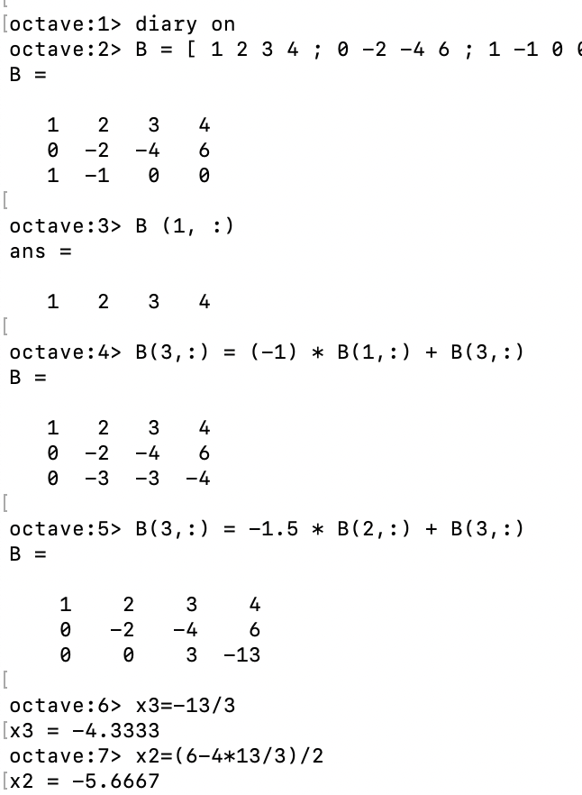
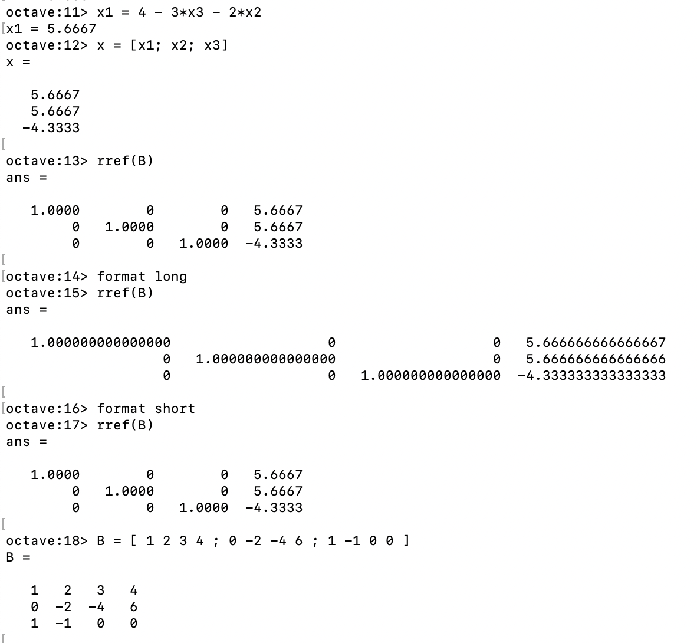
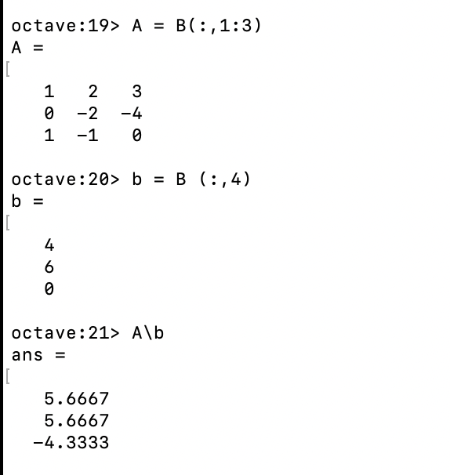
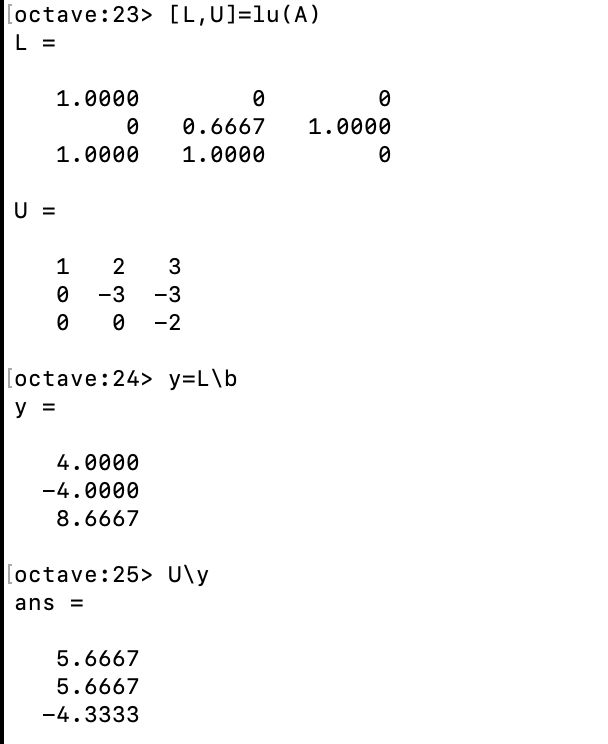
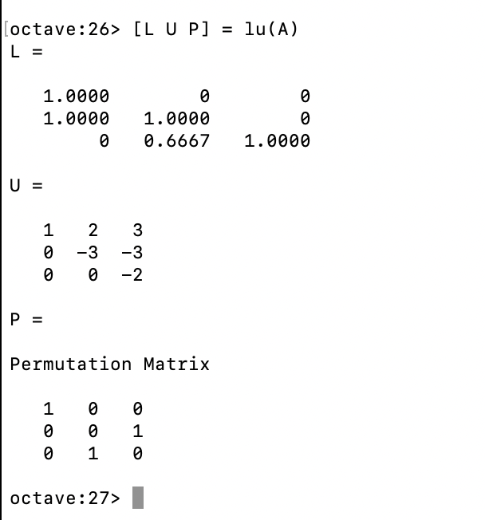

---
# Front matter
lang: ru-RU
title: "Отчёт по лабораторной работе №4"
subtitle: "Системы линейных уравнений"
author: "Виктория михайловна Шутенко, НФИбд-03-19"

# Formatting
toc-title: "Содержание"
toc: true # Table of contents
fontsize: 12pt
linestretch: 1.5
papersize: a4paper
documentclass: scrreprt
polyglossia-lang: russian
polyglossia-otherlangs: english
mainfont: PT Serif
romanfont: PT Serif
sansfont: PT Sans
monofont: PT Mono
mainfontoptions: Ligatures=TeX
romanfontoptions: Ligatures=TeX
sansfontoptions: Ligatures=TeX,Scale=MatchLowercase
monofontoptions: Scale=MatchLowercase
indent: true
pdf-engine: lualatex
header-includes:
  - \linepenalty=10 # the penalty added to the badness of each line within a paragraph (no associated penalty node) Increasing the value makes tex try to have fewer lines in the paragraph.
  - \interlinepenalty=0 # value of the penalty (node) added after each line of a paragraph.
  - \hyphenpenalty=50 # the penalty for line breaking at an automatically inserted hyphen
  - \exhyphenpenalty=50 # the penalty for line breaking at an explicit hyphen
  - \binoppenalty=700 # the penalty for breaking a line at a binary operator
  - \relpenalty=500 # the penalty for breaking a line at a relation
  - \clubpenalty=150 # extra penalty for breaking after first line of a paragraph
  - \widowpenalty=150 # extra penalty for breaking before last line of a paragraph
  - \displaywidowpenalty=50 # extra penalty for breaking before last line before a display math
  - \brokenpenalty=100 # extra penalty for page breaking after a hyphenated line
  - \predisplaypenalty=10000 # penalty for breaking before a display
  - \postdisplaypenalty=0 # penalty for breaking after a display
  - \floatingpenalty = 20000 # penalty for splitting an insertion (can only be split footnote in standard LaTeX)
  - \raggedbottom # or \flushbottom
  - \usepackage{float} # keep figures where there are in the text
  - \floatplacement{figure}{H} # keep figures where there are in the text
---

# Цель работы

Приобрести практические навыки работы с системами линейных уравнений.

# Выполнение лабораторной работы

## 4.4.1 Метод Гаусса

1. После внимательного изучения методички я приступила к выполнению заданий. Сначала я делала 4.1.1
- Для заданной матрицы А надо было построить расширинную матрицу В.
 $$>>B = [1,2,3,4; 0,-2,-4,6; 1,-1,0,0]$$
- Я просмотрела ее поэлементно и получила ответ -4. Он является скаляром, находящимся на строке 2 и столбце 3.	  
$$>>B(2,3)$$
- Также я извлекла целый вектор строки т.е. первую строку матрицы, используя команду:
$$>>B(1,:)$$
- Далее я начала реализовывать метод Гаусса для заданной матрицы В:
	- Сначала добавила к третьей строке первую, умноженную на минус один:
$$>>B(3,:) = (-1) * B(1,:) + B(3,:)$$
	- В полученном ответе получилось избавиться от 1 в третьей строке.
	- Далее я избавилась от минус три в третьей строке. Для этого я добавила к третьей строке вторую, умноженную на минус полтара. (Рис. 1)
$$>>B(3,:) = -1,5 * B(2,:) + B(3,:)$$
	- Теперь матрица имеет треугольный вид. После я вырозила x~1~, x~2~, x~3~. (Рис. 1-2) И задал вектор полученных значений х.
- Далее через Octave выполнила поиск треугольной матрицы:
$$>>rref(В)$$
- В полученном ответе я заметила тот факт, что все числа записываются с плавающей точкой (как десятичные дроби).
- Я отобразила больше десятичных разрядов, введя:
$$>>format long$$
$$>>rref(В)$$
- Потом я вернусь в предыдущий формат.(Рис. 2)
$$>>format short$$
$$>>rref(В)$$

{ 	#fig:001 width=70% }

{ 	#fig:001 width=70% }

## 4.4.2 Левое деление

1. Далее я работала с левым делением:
- Встроенная операция для решения линейных систем вида $$Ax=b$$ в Octave называется левым делением и записывается как:
$$>>Abackslashb$$
- Выделила из расширинной матрицы В матрицу А и вектор b:
$$>>A = B(:,1:3)$$
$$>>b = B(:,4)
- После я нашла вектор x (Рис. 3):
$$>>Abackslashb$$

{ 	#fig:001 width=70% }

## 4.4.3 LU-разложение

1. С помощью надо Octave было расписать заданную матрицу и ее LU-разложение.
- LU-разложение - это вид факторизации матриц для метода Гаусса. Необходимо записать матрицу А в виде:
$$A=LU$$
	- где L - нижняя треугольная матрица,
	- U - верхняя треугольная матрица
- LU-разложение существует, когда матрица А обратима и все главные миноры невыроженны.
- С помощью следующей команды я нашла матрицы L и U:
$$[L, U] = lu(A)$$
- Затем я нашла у, используя левое деление:
$$y = Lbackslashb$$
- Также через левое деление янашла х. (Рис. 4):
$$Ubackslashy$$

{ 	#fig:001 width=70% }

## 4.4.4 LUP-разложение

1. Я задала LUP-разложение с помощью команды(Рис. 5):
$[LUP] = lu(A)$$

{ 	#fig:001 width=70% }

# Выводы

В ходе выполнения лабораторной работы я приобрела практическик навыки работы с системами линейных уравнений в Octave. 
