---
# Front matter
lang: ru-RU
title: "Отчёт по лабораторной работе №5"
subtitle: "Графики и операции над ними"
author: "Виктория Mихайловна Шутенко, НФИбд-03-19"

# Formatting
toc-title: "Содержание"
toc: true # Table of contents
fontsize: 12pt
linestretch: 1.5
papersize: a4paper
documentclass: scrreprt
polyglossia-lang: russian
polyglossia-otherlangs: english
mainfont: PT Serif
romanfont: PT Serif
sansfont: PT Sans
monofont: PT Mono
mainfontoptions: Ligatures=TeX
romanfontoptions: Ligatures=TeX
sansfontoptions: Ligatures=TeX,Scale=MatchLowercase
monofontoptions: Scale=MatchLowercase
indent: true
pdf-engine: lualatex
header-includes:
  - \linepenalty=10 # the penalty added to the badness of each line within a paragraph (no associated penalty node) Increasing the value makes tex try to have fewer lines in the paragraph.
  - \interlinepenalty=0 # value of the penalty (node) added after each line of a paragraph.
  - \hyphenpenalty=50 # the penalty for line breaking at an automatically inserted hyphen
  - \exhyphenpenalty=50 # the penalty for line breaking at an explicit hyphen
  - \binoppenalty=700 # the penalty for breaking a line at a binary operator
  - \relpenalty=500 # the penalty for breaking a line at a relation
  - \clubpenalty=150 # extra penalty for breaking after first line of a paragraph
  - \widowpenalty=150 # extra penalty for breaking before last line of a paragraph
  - \displaywidowpenalty=50 # extra penalty for breaking before last line before a display math
  - \brokenpenalty=100 # extra penalty for page breaking after a hyphenated line
  - \predisplaypenalty=10000 # penalty for breaking before a display
  - \postdisplaypenalty=0 # penalty for breaking after a display
  - \floatingpenalty = 20000 # penalty for splitting an insertion (can only be split footnote in standard LaTeX)
  - \raggedbottom # or \flushbottom
  - \usepackage{float} # keep figures where there are in the text
  - \floatplacement{figure}{H} # keep figures where there are in the text
---

# Цель работы

Приобрести практические навыки работы с графиками и преобразованиями над ними в Octave.

# Выполнение лабораторной работы

## Подгонка полиноминальной кривой

1. Для начала я задала матрицу D.
 $$>>D = [1, 1; 2,2; 3,5; 4,4; 5,2; 6, -3]$$
- Далее я извлекла векторы х и у (Рис. 01):	  
$$>>xdata = D(:,1)$$
$$>>ydata = D(:,2)$$
- Потом нарисова точки на графике:
$$>>plot(xdata,ydata,'o-')$$
- Получился графиик 1 (рис. 02).

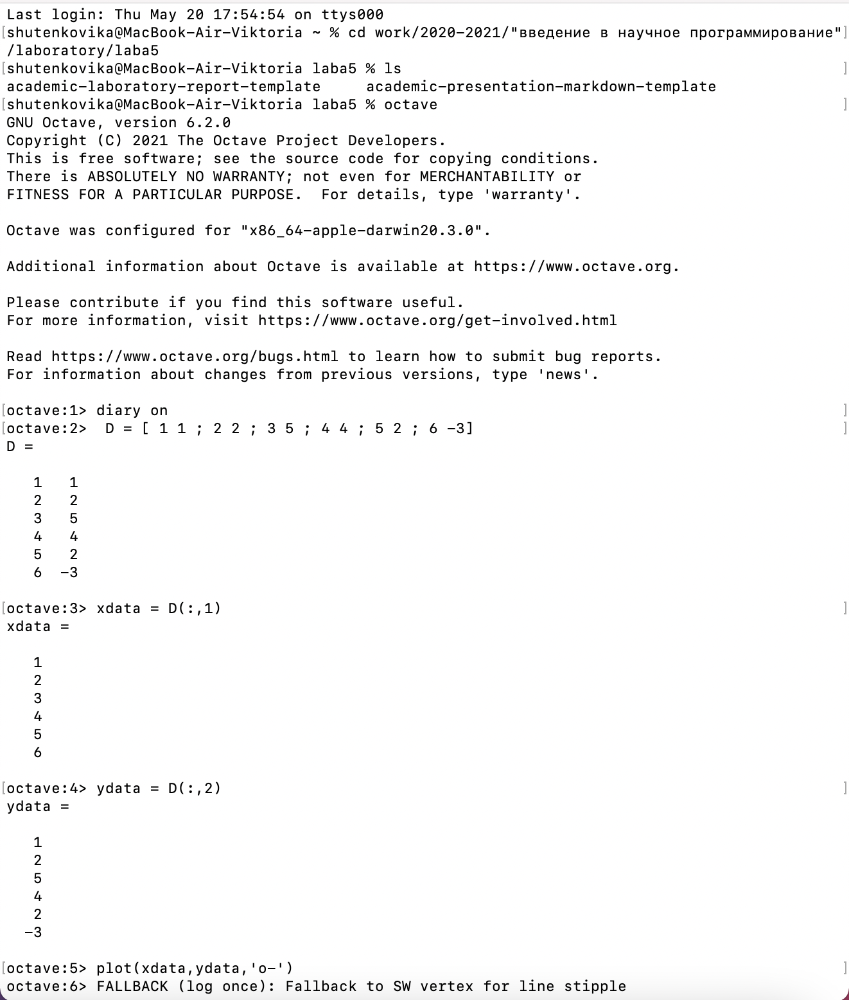{ 	#fig:001 width=70% }

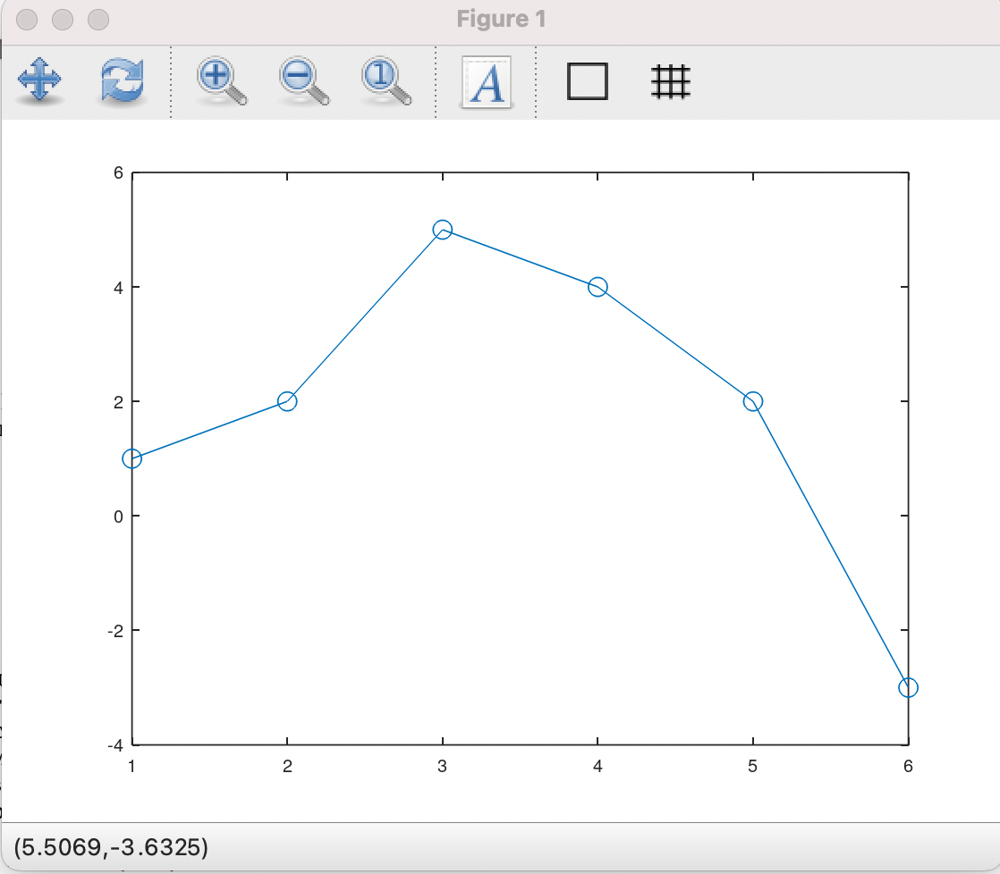{ 	#fig:001 width=70% }

- Далее я построила уравнение вида:
$$>>y = ax^2 + bx + c$$
	- Данная матрица имеет особый вид: первый столбец содержит квадраты значений х, второй столбец - значения х, а третий - все единицы. Для того чтобы построить матрицу коэффициентов, я использовала команду ones.Так я задала матрицу единиц соответствующего размера, а затем переписала первый и второй столбцы соответствующими данными. (Рис. 03)
$$>>A = ones(6,3)$$
$$>>A(:,1) = xdata .^2$$
$$>>A(:,2) = xdata$$

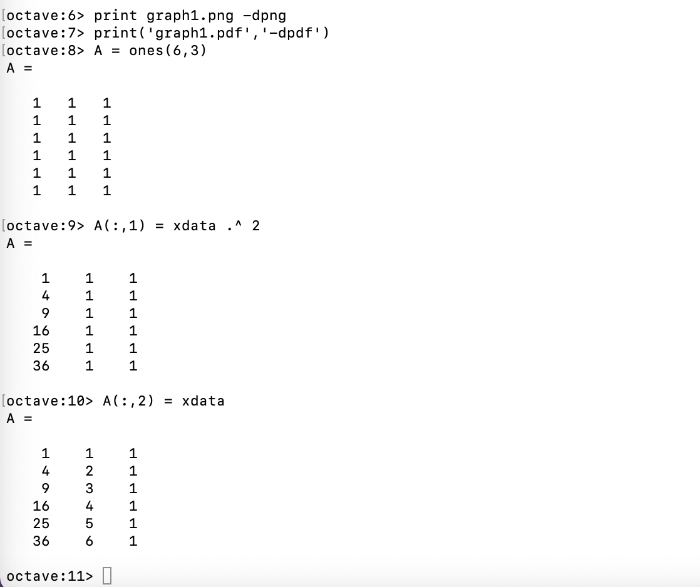{ 	#fig:001 width=70% }

	- Потом я использовала Octave для решения по методу наименьших квадратов, через решение уравнения:
$$>>A^T Ab = A^T y$$
	-   где y - вектор коэффициентов полинома. (Рис. 04)
$$>>A' * A$$
$$>>A' * ydata$$
- Далее задача решалась методом Гаусса. Для начала я задала расширенную матрицу В.
$$>>В = A' * A$$
$$>>В (: ,4)A' * ydata$$
$$>>B _ res = rref(B)$$
$$>>a1=B-res(1,4)$$
$$>>a2=B-res(2,4)$$
$$>>a3=B-res(3,4)$$
- Квадратное уравнение приняло вид:
$$>>y = -0,89286x^2 + 5,65x - 4,4$$

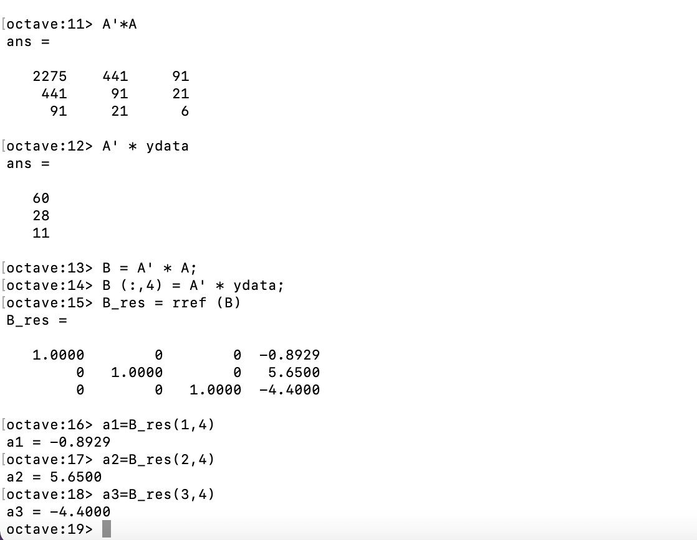{ 	#fig:001 width=70% }

- Далее, я выполнила построение графика параболывведя (Рис. 05):
$$>>x=linspace(0,7,50;)$$
$$>>y = a1 * x .^ 2 + a2 * x + a3$$
$$>>plot(xdata,ydata,'o', x,y,'linewidth',2)$$
$$>>grid on$$
$$>>legend ('data values', 'least-squares parabola')$$
$$>>title('y = -0,89286x^2 + 5,65x - 4,4')$$
- Получился график 2. (Рис. 06)

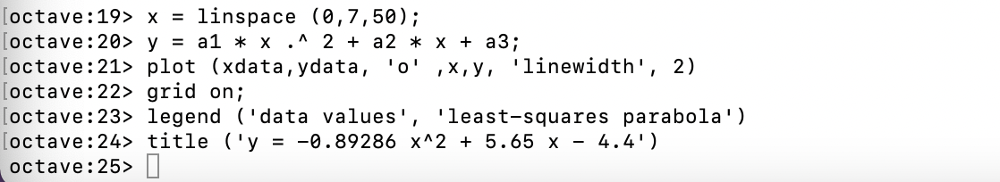{ 	#fig:001 width=70% }

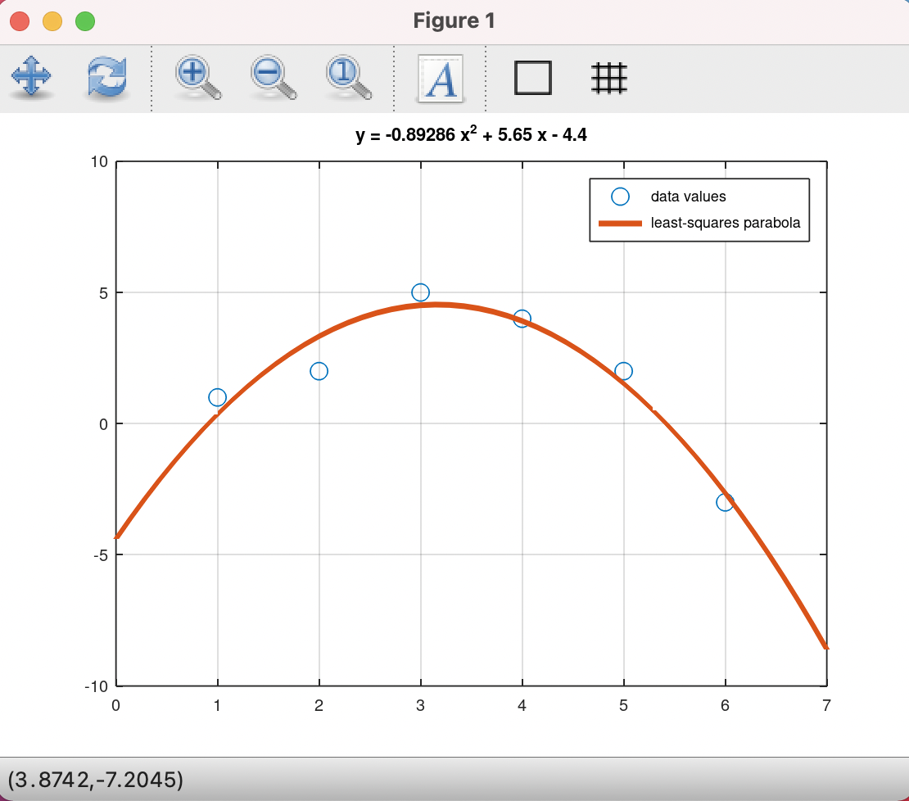{ 	#fig:001 width=70% }

- Далее выполнил подгонку, используя команду polyfit (Рис. 07):
$$>>P=polyfit(xdata,ydata,2)$$
- Расчитала значение полинома в точках:
$$>>y = polyval(P, xdata)$$
- Построила исходные и подгоночные данные и получила график 3. (Рис. 08)
$$>>plot(xdata,ydata,'o-', xdata,y,'+-')$$
$$>>grid on$$
$$>>legend ('original data', 'polyfit data')$$

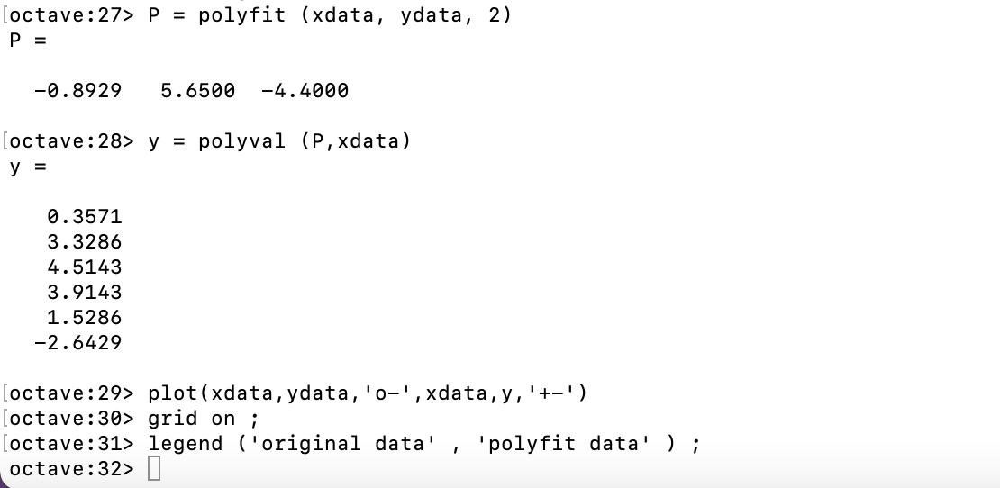{ 	#fig:001 width=70% }

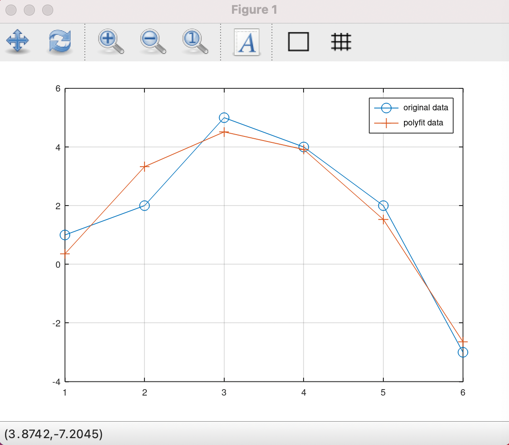{ 	#fig:001 width=70% }

## Матричные преобразования 

1. Далее я работала с построением графа матрицы. В методичке рассматривается метод перечисления ряда вершин, соединенных последовательно. Я строила граф-домик по методу Эйлера.
- Сначала задала матрицу D.(Рис.9)

$$>>D = [1	1	3	3	2	1	3;	2	0	0	2	3	2	2]$$
$$>>x=D(1,:)$$
$$>>y=D(2,:)$$
$$>>plot(x,y)$$
- Получился граф-домик. (Рис. 10)
- Выделила из расширинной матрицы В матрицу А и вектор b:
$$>>A = B(:,1:3)$$
$$>>b = B(:,4)$$

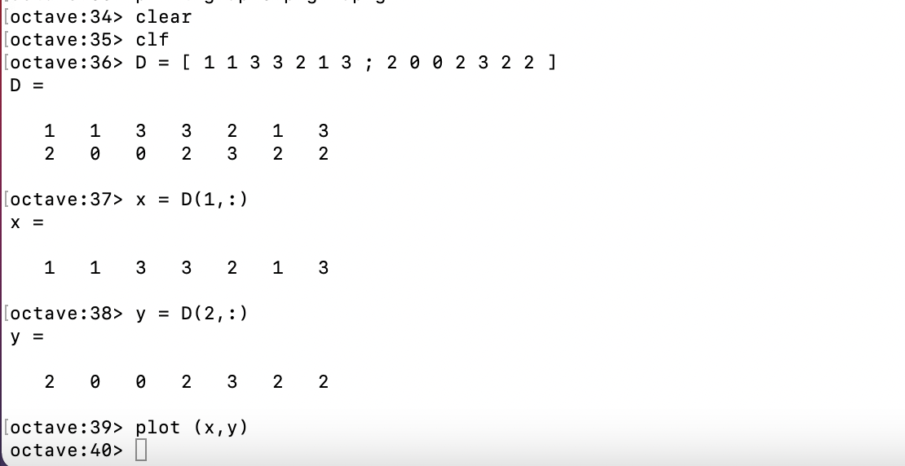{ 	#fig:001 width=70% }

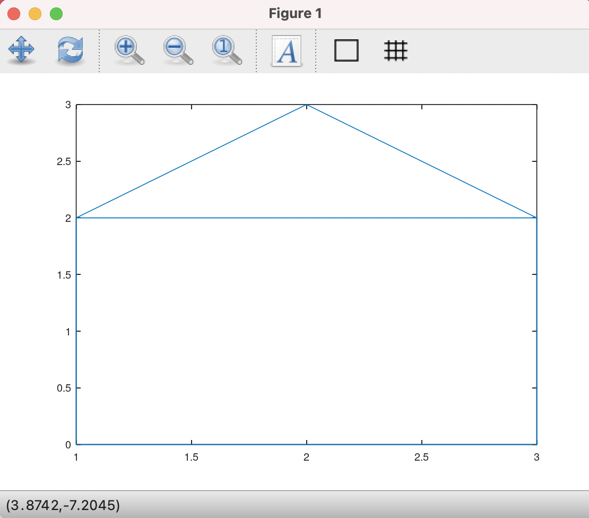{ 	#fig:001 width=70% }

## Вращение

1. Потом я перешла к вращениям. Вращения получаюся  с использованием умножения на специальную матрицу R. Выполнила повороты матрицы D, используя произведение матриц RD. Я должна была выполнить поворот графа-домика на 90 и 225. Для этого я выполнила следующие действия:
- Перевела угол в радианы для угла 90:
$$>>theta1 = 90*pi/180$$
$$>>R1=[cos(theta1)	-sin(theta1);	sin(theta1)	cos(theta1)]$$
$$>>RD1=R1*D$$
$$>>x1=RD1(1,:)$$
$$>>y1=RD1(2,:)$$
- Затем я перевела угол в радианы для угла 225:
$$>>theta2 = 225*pi/180$$
$$>>R2=[cos(theta2)	-sin(theta2);	sin(theta2)	cos(theta2)]$$
$$>>RD2=R2*D$$
$$>>x2=RD2(1,:)$$
$$>>y2=RD2(2,:)$$
- Далее я построила новый график по полученным данным:
$$>>plot(x,y,'bo-', x1,y1,'ro-',x2,y2,'go-')$$
$$>>axis([-4 4 -4 4], 'equal');$$
$$>>grid on$$
$$>>legend ('original', 'rotated 90 deg', 'rotated 225 deg');$$

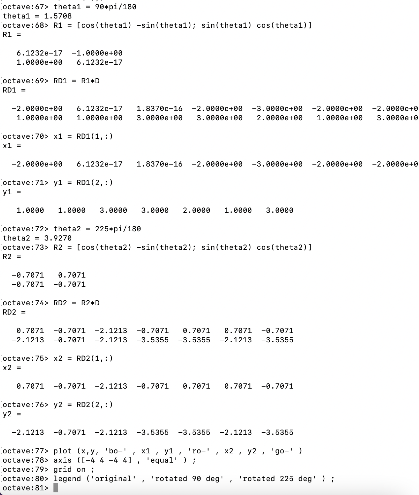{ 	#fig:001 width=70% }

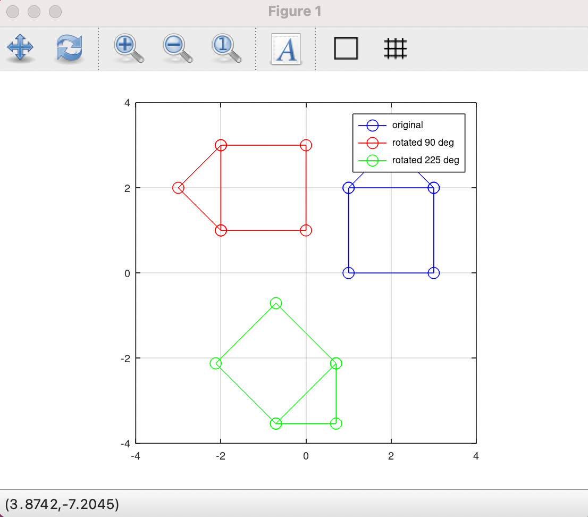{ 	#fig:001 width=70% }

## Отражение

1. В этом пункте я отражала граф-дом относительно прямой у = х:
- Сначала я задала матрицу отражения:
$$>>R =[0 1; 1 0]$$
$$>>RD=R*D$$
$$>>x1=RD(1,:)$$
$$>>y1=RD (2,:)$$
- Потом построила график по полученным данным:
$$>>plot(x,y,'o-', x1,y1,'o-')$$
$$>>axis([-4 4 -4 4], 'equal');$$
$$>>axis([-1 5 -1 5], 'equal');$$
$$>>grid on$$
$$>>legend ('original', 'reflected');$$

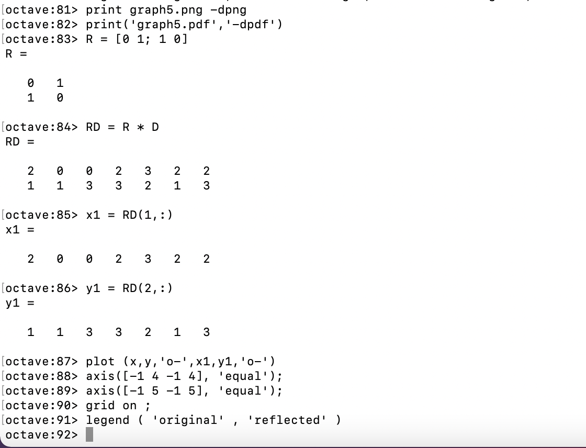{ 	#fig:001 width=70% }

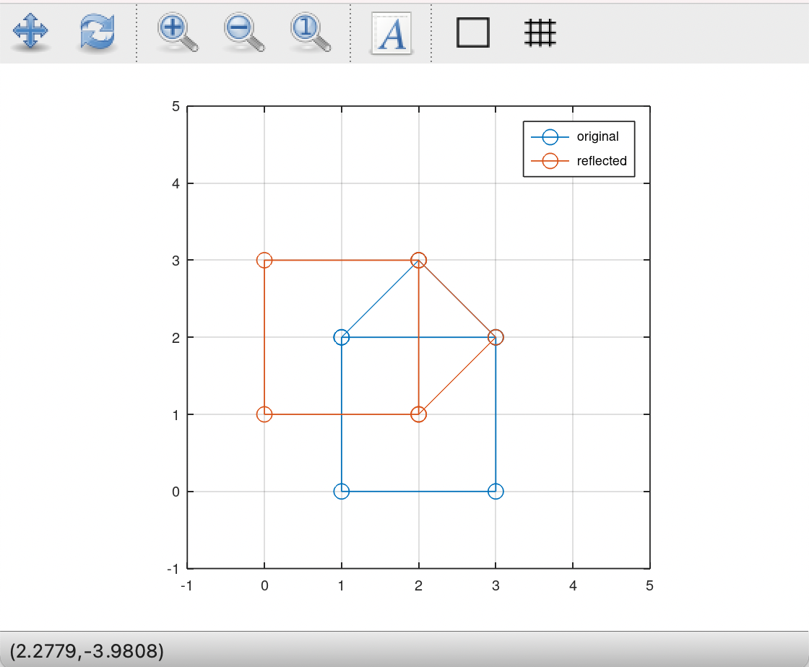{ 	#fig:001 width=70% }

## Дилатация

1. Диалотация - это расширение или сжатие, которое тоже выполняется перемножением матриц. Я должна была увеличить грааф-домик в 2 раза:
- Задала матрицу дилатации:
$$>>T =[2 0; 0 2]$$
$$>>TD=T*D$$
$$>>x1=TD(1,:)$$
$$>>y1=TD (2,:)$$
- Наконец, я построила график по полученным данным:
$$>>plot(x,y,'o-', x1,y1,'o-')$$
$$>>axis([-1 7 -1 7], 'equal');$$
$$>>grid on$$
$$>>legend ('original', 'expanded');$$

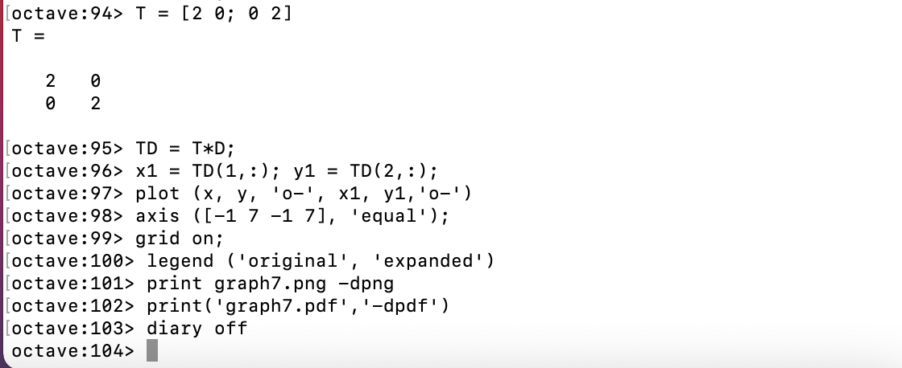{ 	#fig:001 width=70% }

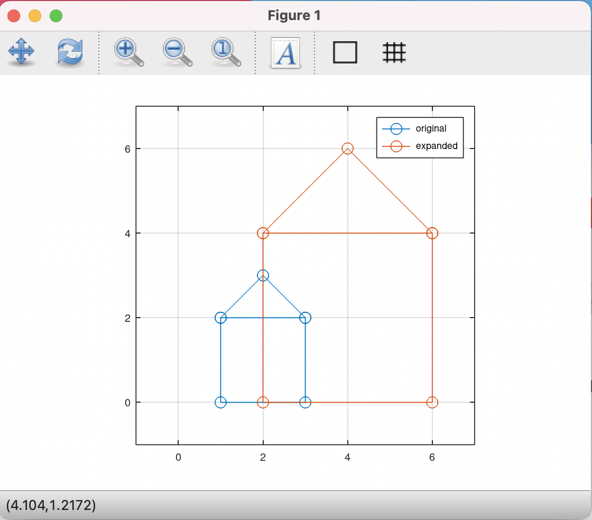{ 	#fig:001 width=70% }

# Выводы

В ходе выполнения лабораторной работы я приобрела практические навыки работы с графиками и их преобразования в Octave. 
