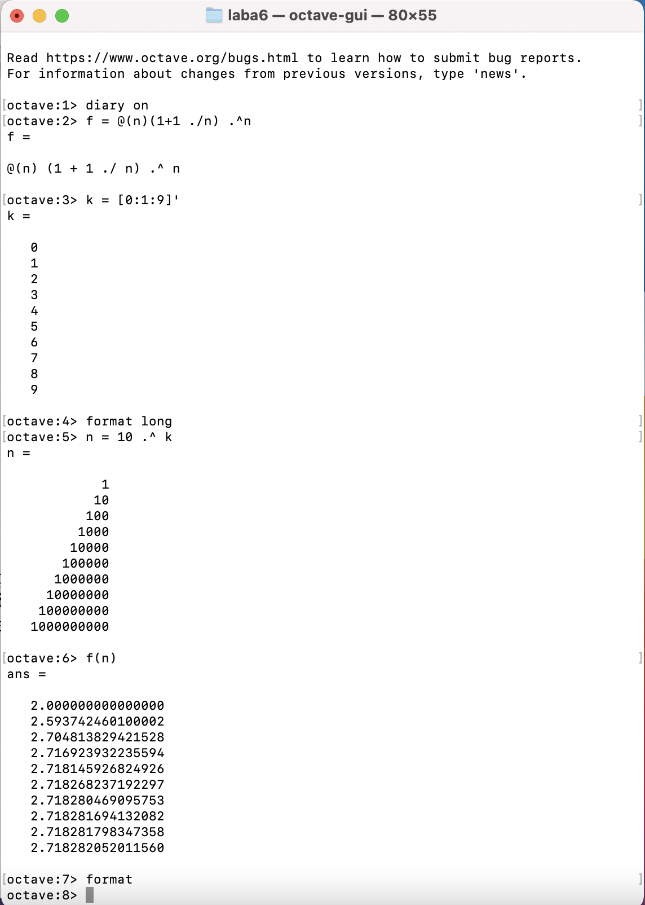
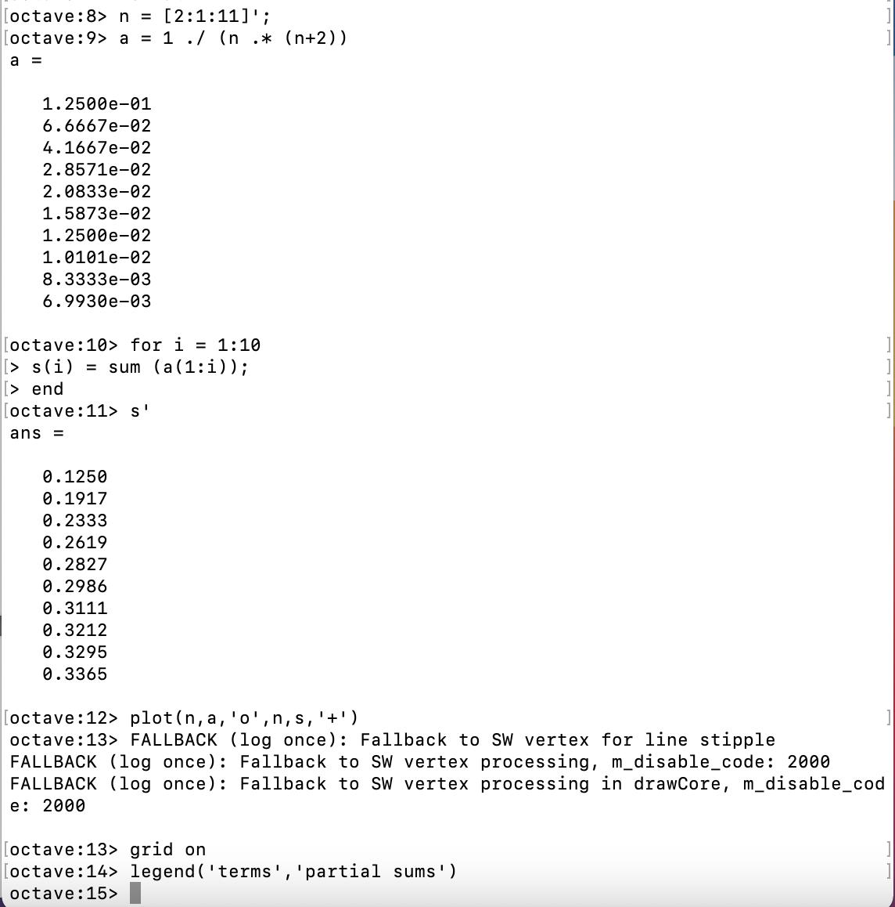
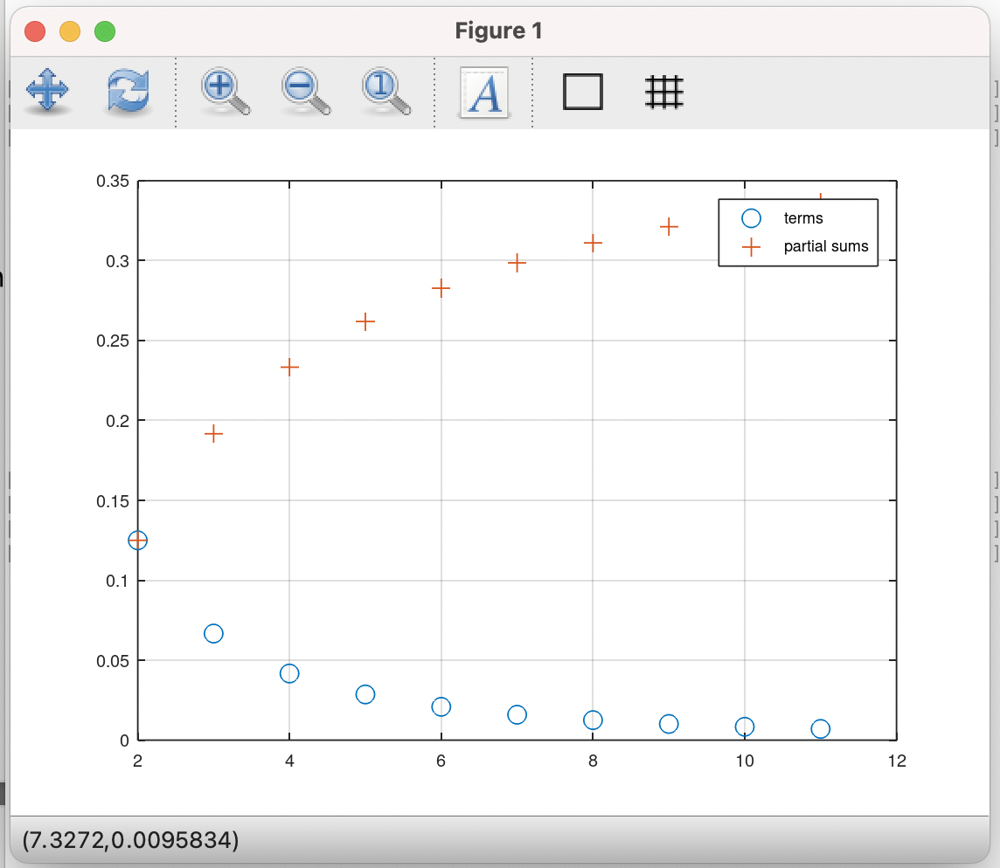
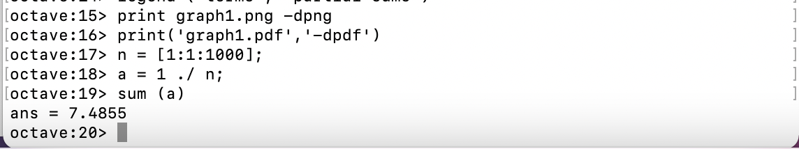
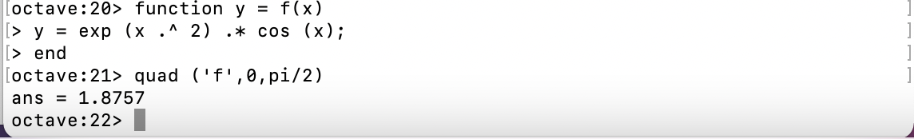
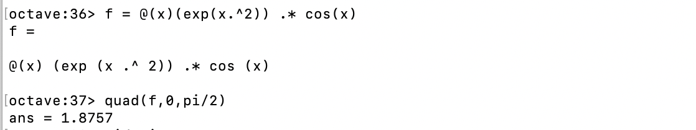
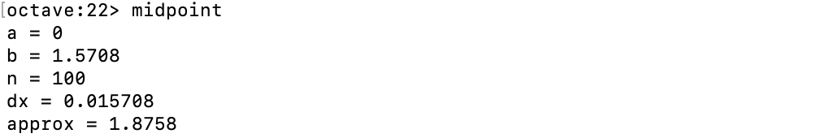
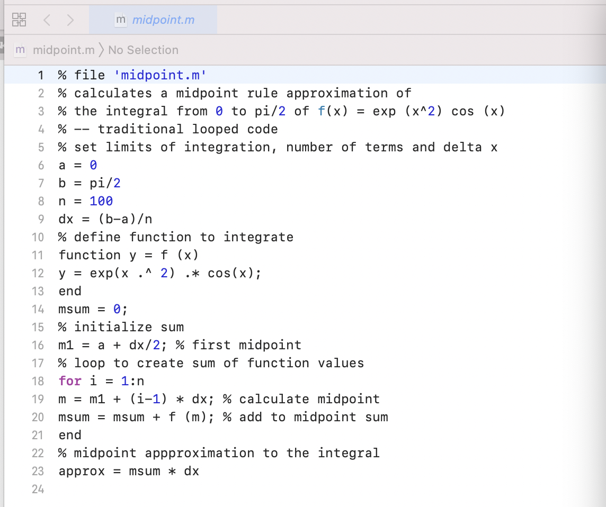
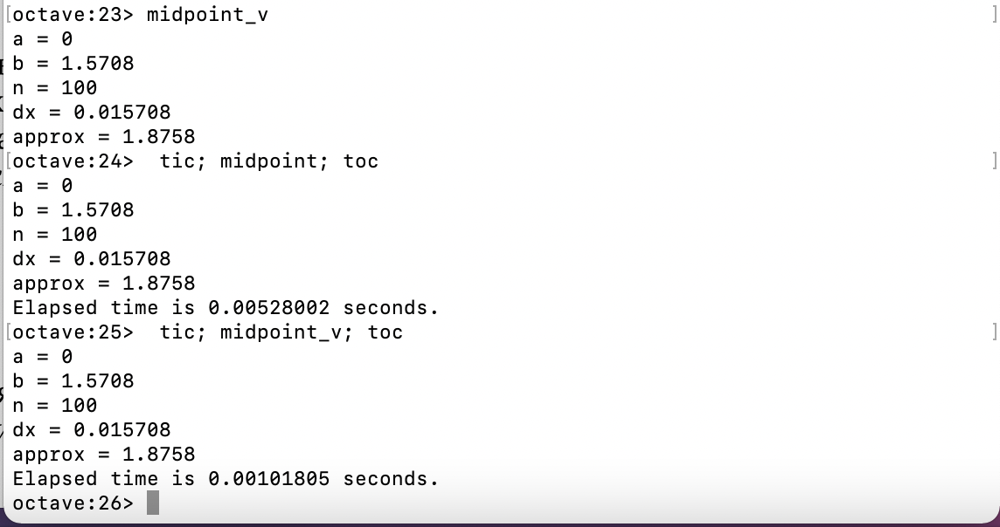
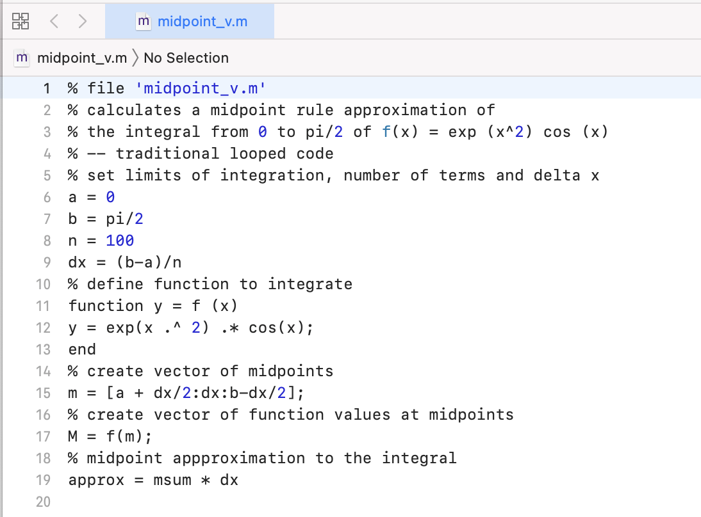

---
# Front matter
lang: ru-RU
title: "Отчёт по лабораторной работе №6"
subtitle: "Пределы, последовательности и ряды"
author: "Виктория Mихайловна Шутенко, НФИбд-03-19"

# Formatting
toc-title: "Содержание"
toc: true # Table of contents
fontsize: 12pt
linestretch: 1.5
papersize: a4paper
documentclass: scrreprt
polyglossia-lang: russian
polyglossia-otherlangs: english
mainfont: PT Serif
romanfont: PT Serif
sansfont: PT Sans
monofont: PT Mono
mainfontoptions: Ligatures=TeX
romanfontoptions: Ligatures=TeX
sansfontoptions: Ligatures=TeX,Scale=MatchLowercase
monofontoptions: Scale=MatchLowercase
indent: true
pdf-engine: lualatex
header-includes:
  - \linepenalty=10 # the penalty added to the badness of each line within a paragraph (no associated penalty node) Increasing the value makes tex try to have fewer lines in the paragraph.
  - \interlinepenalty=0 # value of the penalty (node) added after each line of a paragraph.
  - \hyphenpenalty=50 # the penalty for line breaking at an automatically inserted hyphen
  - \exhyphenpenalty=50 # the penalty for line breaking at an explicit hyphen
  - \binoppenalty=700 # the penalty for breaking a line at a binary operator
  - \relpenalty=500 # the penalty for breaking a line at a relation
  - \clubpenalty=150 # extra penalty for breaking after first line of a paragraph
  - \widowpenalty=150 # extra penalty for breaking before last line of a paragraph
  - \displaywidowpenalty=50 # extra penalty for breaking before last line before a display math
  - \brokenpenalty=100 # extra penalty for page breaking after a hyphenated line
  - \predisplaypenalty=10000 # penalty for breaking before a display
  - \postdisplaypenalty=0 # penalty for breaking after a display
  - \floatingpenalty = 20000 # penalty for splitting an insertion (can only be split footnote in standard LaTeX)
  - \raggedbottom # or \flushbottom
  - \usepackage{float} # keep figures where there are in the text
  - \floatplacement{figure}{H} # keep figures where there are in the text
---

# Цель работы

Приобрести практические навыки работы с пределами, последовательностями и рядами в Octave.

# Выполнение лабораторной работы

## Предел

1. В 1 пункте нужно было определить функцию. Я использовала приведенный в методичке способ анонимной функции. Так я смогла определить простую функцию.
 $$>>f = @(n) (1 + 1 ./ n) .^ n$$
- где @ - входная переменная
2. Далее я создала индексную переменную, состоящую из целых чисел от 0 до 9. (Рис. 01):	  
$$>>k = [0: 1: 9]'$$
3. Синтаксис[0: 1: 9]вектор строки начинается с нуля и увеличивается с шагам от одного до девяти. Я заметила, что использовалась операция транспонирования для того, чтобы результат было легче читать как вектор-столбцы. Далее я взяла степени 10 которые будут входными значениями, а затем оценила их:
- Потом нарисова точки на графике:
$$>>format long$$
$$>> n = 10 .^ k$$
$$>>f(n)$$
$$>>format$$
4. В итоге я получила то, что предел сходится к конечному значению, которое составляет приблизительно 2,718... Подобные методы могут быть использованы для численного исследования последовательностей и рядов (Рис. 01)

{ 	#fig:001 width=70% }

## Частичные суммы 

1. Далее я работала с заданной в методичке суммой ряда.
2. Для начало я определила индекс вектора  n от двух до 11 а затем вычислила его члены (Рис. 02):
$$>>n = [2: 1: 11]';$$
$$>>a = 1 ./ (n .* (n+2))$$
3. Для того чтобы узнать частную сумму нужно написать  sum(a). A  чтобы получить последовательность частных сумм, то нужно использовать цикл. Я использовала цикл for с индексом i от 1 до 10. Для каждого i получила частичную сумму последовательности а_n от первого слагаемого до i cлагаемого. На выходе получается 10-й элементный вектор из этих частных сумм.
$$ >>for i = 1:10$$
$$s (i) = sum (a(1:i));$$
$$end$$
$$>> s'$$
4. Потом я построила слагаемые и частичные суммы для n и получила следующий граф (Рис. 03).
$$>>plot (n,a,'o',n,s,'+')$$
$$>>grid on$$
$$>>legend ('terms', 'partial sums')$$

{ 	#fig:001 width=70% }

{ 	#fig:001 width=70% }

## Сумма ряда

1. Далее я искала сумму первых 1000 членов гармонического ряда. Для этого сгенерировала члены ряда, как вектор, и взяла их сумму (Рис.04).  
$$>>n = [1: 1: 1000];$$
$$>>a = 1 ./ n;$$
$$>>sum (a)$$

{ 	#fig:001 width=70% }

## Численное Интегрирование Вычисление интеграллов

1. Для вычисления интегралов я использовала команду quad.
2. Для начало я определила функцию. Я заметила, что функция exp(x) используется для е^2 (Рис. 05). 
$$>>function y = f(x)$$
$$y = exp (x .^ 2) .* cos (x);$$
$$>>end$$
$$>>quad ('f',0,pi/2)$$

{ 	#fig:001 width=70% }

3.  Позднее я разобралась с пунктом использования анонимной функции.(Рис. 06)
$$f = @(x)(exp(x.^2)) .* cos(x)$$

{ 	#fig:001 width=70% }

## Аппроксимерование суммами

1. Я написала скрипт для того чтобы вычислить интеграл. По правилу средней точки для n равного 100. Стратегия заключалась в использовании цикла, который добавляет значение функции к промежуточной сумме с каждой итерации. В конце сумма умножается на дельта икс
2. Я заранее подготовила два файла: midpoint и midpoint_v используя   VSC(Рис. 08, 010).
3.  Запустила midpoint (Рис. 07)
$$>>midpoint$$
4. Запустила midpoint_v (Рис. 09)
$$>>midpoint_v$$
5. Наконец, я сравнила результаты и поняла, что первый способ быстрее (Рис. 09)
$$>>tic; midpoint; toc$$
$$>>tic; midpoint_v; toc$$

{ 	#fig:001 width=70% }

{ 	#fig:001 width=70% }

{ 	#fig:001 width=70% }

{ 	#fig:001 width=70% }

# Выводы

В ходе выполнения лабораторной работы я приобрела практические навыки работы с пределами, последовательностями и рядами в Octave. 
