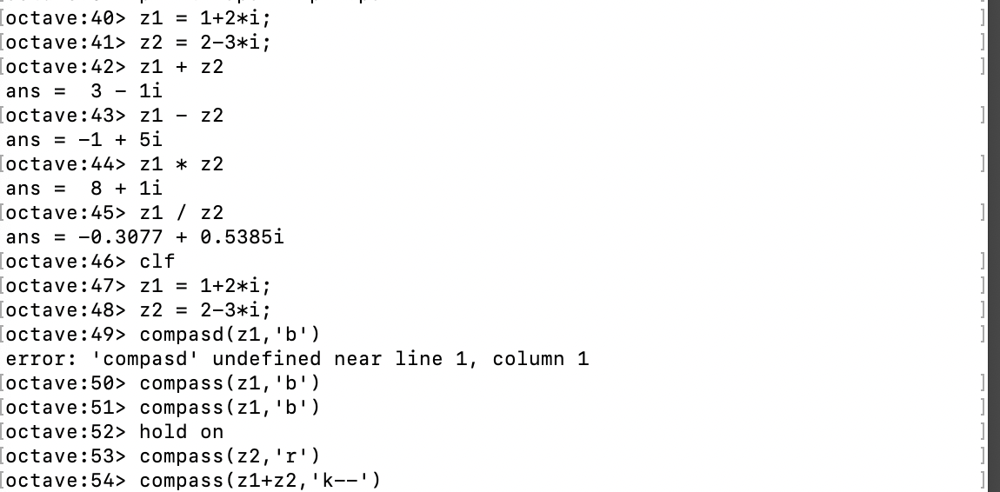

---
# Front matter
lang: ru-RU
title: "Отчёт по лабораторной работе №7"
subtitle: "Графики"
author: "Виктория Mихайловна Шутенко, НФИбд-03-19"

# Formatting
toc-title: "Содержание"
toc: true # Table of contents
fontsize: 12pt
linestretch: 1.5
papersize: a4paper
documentclass: scrreprt
polyglossia-lang: russian
polyglossia-otherlangs: english
mainfont: PT Serif
romanfont: PT Serif
sansfont: PT Sans
monofont: PT Mono
mainfontoptions: Ligatures=TeX
romanfontoptions: Ligatures=TeX
sansfontoptions: Ligatures=TeX,Scale=MatchLowercase
monofontoptions: Scale=MatchLowercase
indent: true
pdf-engine: lualatex
header-includes:
  - \linepenalty=10 # the penalty added to the badness of each line within a paragraph (no associated penalty node) Increasing the value makes tex try to have fewer lines in the paragraph.
  - \interlinepenalty=0 # value of the penalty (node) added after each line of a paragraph.
  - \hyphenpenalty=50 # the penalty for line breaking at an automatically inserted hyphen
  - \exhyphenpenalty=50 # the penalty for line breaking at an explicit hyphen
  - \binoppenalty=700 # the penalty for breaking a line at a binary operator
  - \relpenalty=500 # the penalty for breaking a line at a relation
  - \clubpenalty=150 # extra penalty for breaking after first line of a paragraph
  - \widowpenalty=150 # extra penalty for breaking before last line of a paragraph
  - \displaywidowpenalty=50 # extra penalty for breaking before last line before a display math
  - \brokenpenalty=100 # extra penalty for page breaking after a hyphenated line
  - \predisplaypenalty=10000 # penalty for breaking before a display
  - \postdisplaypenalty=0 # penalty for breaking after a display
  - \floatingpenalty = 20000 # penalty for splitting an insertion (can only be split footnote in standard LaTeX)
  - \raggedbottom # or \flushbottom
  - \usepackage{float} # keep figures where there are in the text
  - \floatplacement{figure}{H} # keep figures where there are in the text
---

# Цель работы

Приобрести практические навыки работы с графиками в Octave.


# Выполнение лабораторной работы

## Параметрические графики

1. В 1 пункте нужно было построить график трех периодов циклоиды радиуса 2. В соответсвии с тригонометрическим кругом период существует от 0 до 2П, по-этому параметр будет существовать 0 до 6П. Я определила параметр t, как вектор в этом диапозоне, затем вычислила x и у. (Рис 01). 
 
2. Далее я постороила график для х и у (Рис.02). 

3. Используя axis, я задала масштаб.(Рис 03 - 04).
- axis('equal') устанавливает масштаб, который обеспечивает одинаковое расстояние между метками по осям х и у. 
- axis([xmin xmax ymin ymax]) устанавливает масштаб по осям x и y для активного графического окна

4. Далее я сохранила график в форматах pdf и png.

{ 	#fig:001 width=70% }

{ 	#fig:001 width=70% }

{ 	#fig:001 width=70% }

![Задание масштаба через axis([xmin xmax ymin ymax])](images/image4.png){ 	#fig:001 width=70% }

## Полярные координаты

1. Далее я работала с построением улитки Паскаля, которая задается следующим уравнением ```r = 1-2sin(v)```. (Рис. 05). В результе построения я получила следкющий график (Рис. 06).

{ 	#fig:001 width=70% }

{ 	#fig:001 width=70% }

2. Затем я построила функцию *```r = f(v)``` * в полярных осях с использованием команды Polar.(Рис. 07). Так я получила следующий график (Рис. 08)

{ 	#fig:001 width=70% }

{ 	#fig:001 width=70% }

## Графики неявных функций

1. Я построила кривую определяемую уравнением ```-x^2-xy+x+y^2-y=1```.  Для определения функции виде ```f(x,y) = 0``` я выучила 1 из обеих частей уравнения и задала функцию. (Рис. 09).
2. Затем построила график по заданной функции. (Рис. 010).

{ 	#fig:001 width=70% }

{ 	#fig:001 width=70% }

3. Далее я искала уравнение касательной к графику окружности ```(x-2)^2 + y^2 = 25``` в точке (-1, 4). Построила график окружности и касательной. Для построения круга я определила его как функцию вида ```f(x,y) = 0```. (Рис. 09) Получился график. (Рис. 11).

{ 	#fig:001 width=70% }

4. Центр круга находится в точке (2,0), а радиус равен 5. Задала оси графика так, что они несколько превосходят окружность. (Рис. 09) 

5. Далее я вычислила уравнение касательной, которое приняло вид ```y = 3/4x + 19/4``` и построила график. (Рис. 012). Получился следующий график. (Рис. 013).

{ 	#fig:001 width=70% }

{ 	#fig:001 width=70% }

## Комплексные числа

1. Далее работала с комплексными числами. Я делала основные арифметические операции с этими числами. Я выполнила сложения вычитания умножение и деление комплексных чисел. И построила график  комплексной плоскости с использованием команды compass.(Рис. 014)
- график z1 (Рис. 015)
- график z2 (Рис. 016)
- график z1 + z2 (Рис. 017)
- конечный график: z1, z2, z1 + z2. (Рис. 018)


{ 	#fig:001 width=70% }

{ 	#fig:001 width=70% }

{ 	#fig:001 width=70% }

{ 	#fig:001 width=70% }

{ 	#fig:001 width=70% }

2. Далее я работала с корнями в Octave. Сначала я вычитала вычисляла кубический корень обычным способом, а затем через команду nthroot. (Рис. 019). 

{ 	#fig:001 width=70% }

##  Специальные функции

1. Я построила функции Г(х+1) и n! на одном графике. Для этого я задала значение аргумента x от [-5, 5], а для гамма-функции и n = 0,1,2,3,4,5 факториала. (Рис. 020).

2. В процессе построения графика были добавлены сетка, легенда и масштаб. В итоге, получился следующий график (Рис. 021).

{ 	#fig:001 width=70% }

{ 	#fig:001 width=70% }

3. Далее, я обратила внимание на вертикальные Асимптотs на графике в районе отрицательных целых чисел. Они не являются истинной частью графика. Это Артифакты вычисления. Чтобы их устранить, я должна разделить область значений на отдельные интервалы. Это дает более точный график. (Рис. 022).

{ 	#fig:001 width=70% }

4. В итоге, после всех преобразований и добавления легенды, получился следующий график.(Рис. 023).

{ 	#fig:001 width=70% }

# Выводы

В ходе выполнения лабораторной работы я приобрела практические навыки работы с графиками в Octave. 

# Библиография 

1. http://old.exponenta.ru/soft/Matlab/potemkin/book2/chapter10/axis.asp[Электронный ресурс]
2. http://ilfire.ru/kompyutery/shpargalka-po-sintaksisu-markdown-markdaun-so-vsemi-samymi-populyarnymi-tegami/ [Электронный ресурс]
