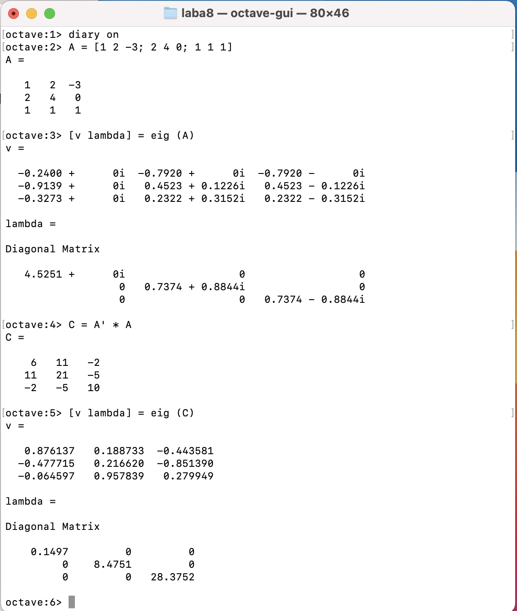
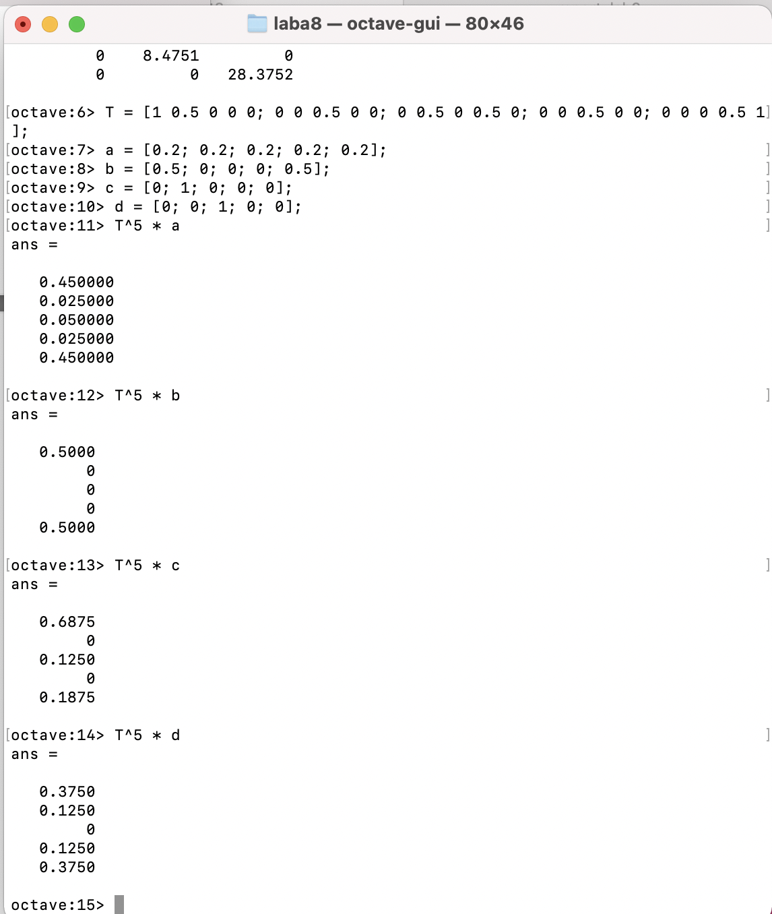
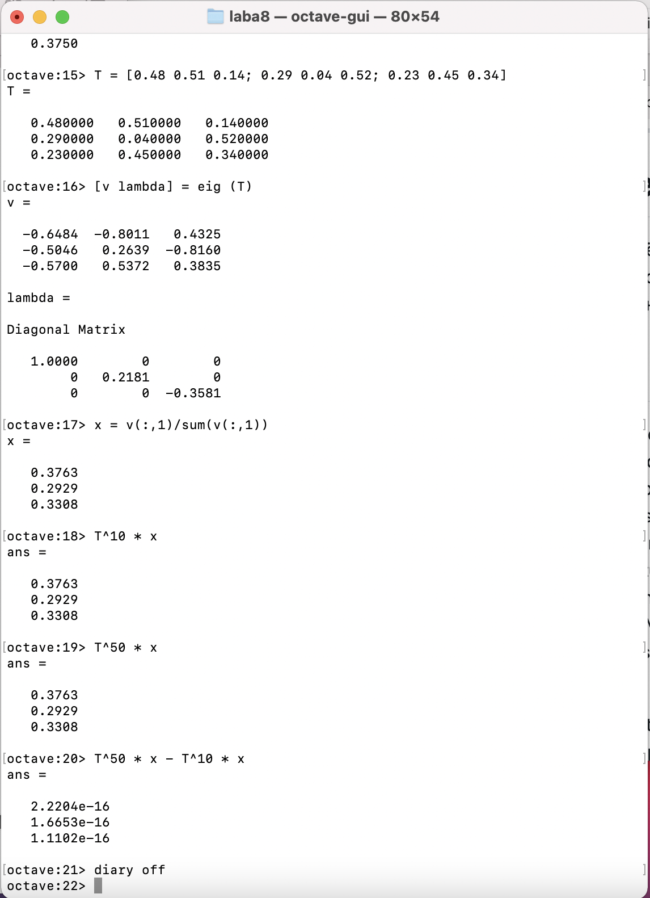

---
# Front matter
lang: ru-RU
title: "Отчёт по лабораторной работе №6"
subtitle: "Задача на собственные значения"
author: "Виктория Mихайловна Шутенко, НФИбд-03-19"

# Formatting
toc-title: "Содержание"
toc: true # Table of contents
fontsize: 12pt
linestretch: 1.5
papersize: a4paper
documentclass: scrreprt
polyglossia-lang: russian
polyglossia-otherlangs: english
mainfont: PT Serif
romanfont: PT Serif
sansfont: PT Sans
monofont: PT Mono
mainfontoptions: Ligatures=TeX
romanfontoptions: Ligatures=TeX
sansfontoptions: Ligatures=TeX,Scale=MatchLowercase
monofontoptions: Scale=MatchLowercase
indent: true
pdf-engine: lualatex
header-includes:
  - \linepenalty=10 # the penalty added to the badness of each line within a paragraph (no associated penalty node) Increasing the value makes tex try to have fewer lines in the paragraph.
  - \interlinepenalty=0 # value of the penalty (node) added after each line of a paragraph.
  - \hyphenpenalty=50 # the penalty for line breaking at an automatically inserted hyphen
  - \exhyphenpenalty=50 # the penalty for line breaking at an explicit hyphen
  - \binoppenalty=700 # the penalty for breaking a line at a binary operator
  - \relpenalty=500 # the penalty for breaking a line at a relation
  - \clubpenalty=150 # extra penalty for breaking after first line of a paragraph
  - \widowpenalty=150 # extra penalty for breaking before last line of a paragraph
  - \displaywidowpenalty=50 # extra penalty for breaking before last line before a display math
  - \brokenpenalty=100 # extra penalty for page breaking after a hyphenated line
  - \predisplaypenalty=10000 # penalty for breaking before a display
  - \postdisplaypenalty=0 # penalty for breaking after a display
  - \floatingpenalty = 20000 # penalty for splitting an insertion (can only be split footnote in standard LaTeX)
  - \raggedbottom # or \flushbottom
  - \usepackage{float} # keep figures where there are in the text
  - \floatplacement{figure}{H} # keep figures where there are in the text
---

# Цель работы

Приобрести практические навыки работы c задачами на собственные значения в Octave.

# Выполнение лабораторной работы

## Собственные значения и собственные векторы

1. Число называют собственным значением или собственным числом данной матрицы. Поскольку каждой квадратной матрице соответствует определенное линейное преобразование (в некотором базисе), то, исходя из содержательного смысла, часто говорят о собственных значениях и собственных векторах линейного преобразования. 
2. В 1 пункте нужно было задать матрицу А и определить собственные векторы этой матрицы. Для этого я использовала команду eig c двумя выходными аргументами.(Рис. 01). Первый элемент результата есть матрица, столбцы которые представляют собой собственные векторы, а второй результат будет диагональной матрицей собственными значениями на диагонали.
3. Далее я получила матрицу с действительными собственными значениями, также я создала симметричную матрицу, которая имеет действительные собственные значения, путём умножения матрицы на транспонированную матрицу. (Рис. 01).
 
{ 	#fig:001 width=70% }

## Марковские цепи. Случайное блуждание 

1. Далее я изучала марковские цепи. Цепь Маркова является стохастической моделью , описывающая последовательность событий, в которой вероятность каждого события зависит от состояния, достигнутого в последнем событии. 
2. Случайное блуждание — математический объект, известный как стохастический или случайный процесс, который описывает путь, состоящий из последовательности случайных шагов в каком-нибудь математическом пространстве (например, на множестве целых чисел). 
- По заданию мне нужно было найти вектор вероятности после пяти шагов для каждого из следующих начальных векторов вероятности (a, b, c, d).(Рис. 02).
- Я сформировала матрицу переходов.
- Далее я вычислила вероятность будущего состояния через начальный вектор вероятности. (Рис. 02).
- Потом я нашла вектор равновесного состояния для цепи Маркова с переходной матрицей.(Рис. 03).

{ 	#fig:001 width=70% }

{ 	#fig:001 width=70% }

# Выводы

В ходе выполнения лабораторной работы я приобрела практические навыки работы с задачами на собственные значения в Octave. 

# Библиография 

1. http://www.mathprofi.ru/sobstvennye_znachenija_i_sobstvennye_vektory.html [Электронный ресурс].
2. https://wikichi.ru/wiki/Markov_chain [Электронный ресурс].