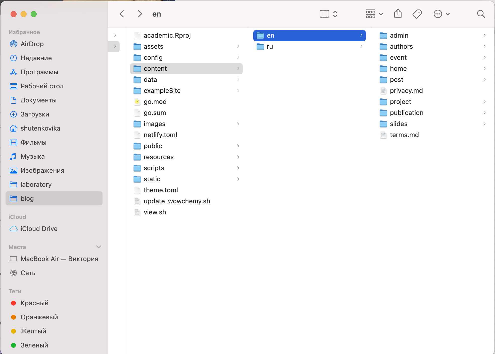
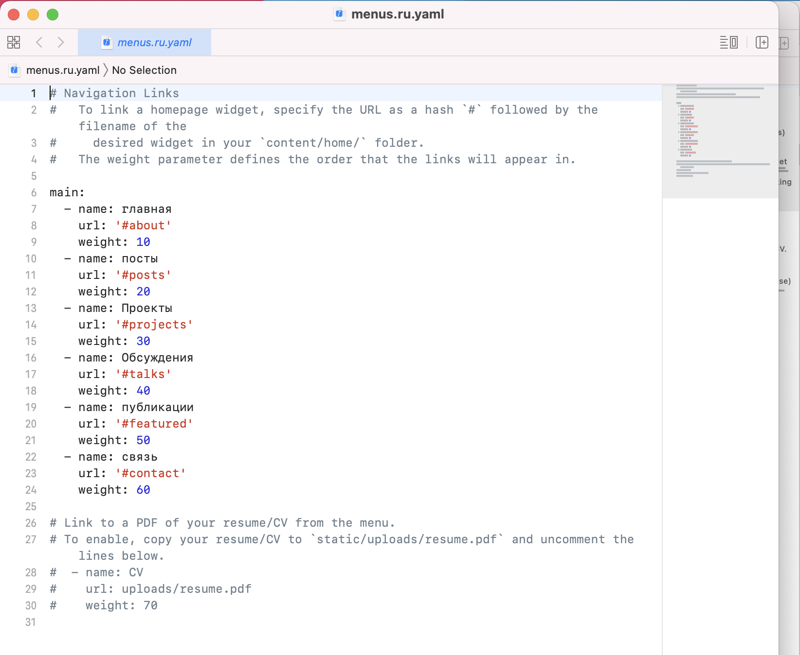

---
# Front matter
lang: ru-RU
title: "Отчёт по 4 этапу индивидуального проекта"
author: "Виктория Mихайловна Шутенко, НФИбд-03-19"

# Formatting
toc-title: "Содержание"
toc: true # Table of contents
fontsize: 12pt
linestretch: 1.5
papersize: a4paper
documentclass: scrreprt
polyglossia-lang: russian
polyglossia-otherlangs: english
mainfont: PT Serif
romanfont: PT Serif
sansfont: PT Sans
monofont: PT Mono
mainfontoptions: Ligatures=TeX
romanfontoptions: Ligatures=TeX
sansfontoptions: Ligatures=TeX,Scale=MatchLowercase
monofontoptions: Scale=MatchLowercase
indent: true
pdf-engine: lualatex
header-includes:
  - \linepenalty=10 # the penalty added to the badness of each line within a paragraph (no associated penalty node) Increasing the value makes tex try to have fewer lines in the paragraph.
  - \interlinepenalty=0 # value of the penalty (node) added after each line of a paragraph.
  - \hyphenpenalty=50 # the penalty for line breaking at an automatically inserted hyphen
  - \exhyphenpenalty=50 # the penalty for line breaking at an explicit hyphen
  - \binoppenalty=700 # the penalty for breaking a line at a binary operator
  - \relpenalty=500 # the penalty for breaking a line at a relation
  - \clubpenalty=150 # extra penalty for breaking after first line of a paragraph
  - \widowpenalty=150 # extra penalty for breaking before last line of a paragraph
  - \displaywidowpenalty=50 # extra penalty for breaking before last line before a display math
  - \brokenpenalty=100 # extra penalty for page breaking after a hyphenated line
  - \predisplaypenalty=10000 # penalty for breaking before a display
  - \postdisplaypenalty=0 # penalty for breaking after a display
  - \floatingpenalty = 20000 # penalty for splitting an insertion (can only be split footnote in standard LaTeX)
  - \raggedbottom # or \flushbottom
  - \usepackage{float} # keep figures where there are in the text
  - \floatplacement{figure}{H} # keep figures where there are in the text
---

# Задание для этапа 4

Разместить двух язычный сайт на github.
# Ход работы

1. Я начала работу с создание двух папок ru eng в папке контент (Рис. 01) 
2. Я редактировала файлы, чтобы они подходили названию папок. То есть в папке eng контент на английском языке, а в папке ru контент на русском. Как пример есть картинка основного файла index где описывается в информации с главной странице.(Рис. 02) 

{ #fig:001 width=70% }

{#fig:001 
width=70% }

4. Далее я работала с меню сайта. Для этого пришлось создать дубль файла menus.ru.yaml  (Рис. 03).

{#fig:001 
width=70% }

5. Все созданные файлы надо добавить в git, для этого запустила hugo и выполнила полагающиеся команды. (Рис. 04).

{#fig:001 width=70% }

#  Вывод
В результате выполнения 4 этапа я смогла сделать возможность переключать сайт с русского на английскийна.
